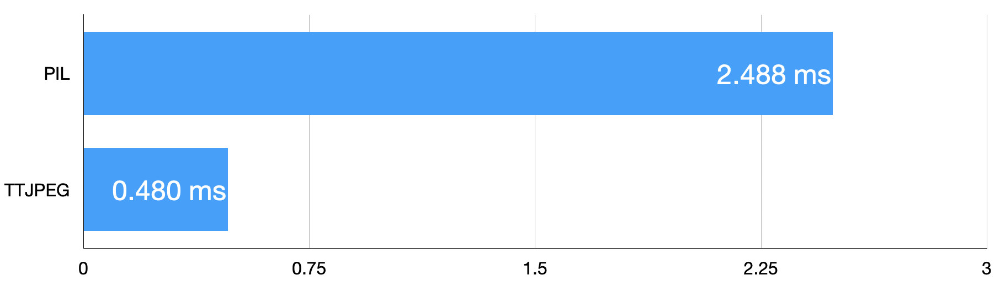

# TorchTurboJPEG

TorchTurboJPEG is a PyTorch extension designed to encode CUDA tensors directly into JPEG streams with optimized performance.

## Features

- **High Performance**: Utilizes NvJPEG from CUDA Toolkit for efficient JPEG encoding.
- **Ease of Use**: Seamless integration with PyTorch, allowing for easy encoding of CUDA tensors.
- **Suitable for Real-Time Applications**: Optimized for performance, making it ideal for online applications.

## Performance
<!-- insert image here -->

Tested on a single Tesla T4 with 100 random 512x512 images.

## Installation

To install TorchTurboJPEG, you can use pip:

```
git clone https://github.com/GhostCai/TorchTurboJPEG
cd TorchTurboJPEG
pip install .
```

Ensure that you have the required dependencies installed, including PyTorch and CUDA.

## Usage

```python
import torch
import numpy as np
from PIL import Image
import torchturbojpeg as ttjpeg

ttencoder = ttjpeg.Encoder(75,1024*1024)

example_image = Image.open('example_input.jpg')
image_cuda = torch.tensor(np.array(example_image)).permute(2, 0, 1).cuda().contiguous()

bytes_tt = ttencoder.encode(image_cuda)
with open('example_tt.jpg', 'wb') as f:
    f.write(bytes(bytes_tt))
```

## Contributing

Contributions to TorchTurboJPEG are welcome! Currently I'm working on fixed input type (i.e. [C,H,W] input tensor on CUDA with type of torch.uint8, and I'm assuming C=3 and H=W=512). Feel free to open an issue or submit a pull request to suggest changes or improvements.

## License

TorchTurboJPEG is licensed under the [MIT License](LICENSE).
